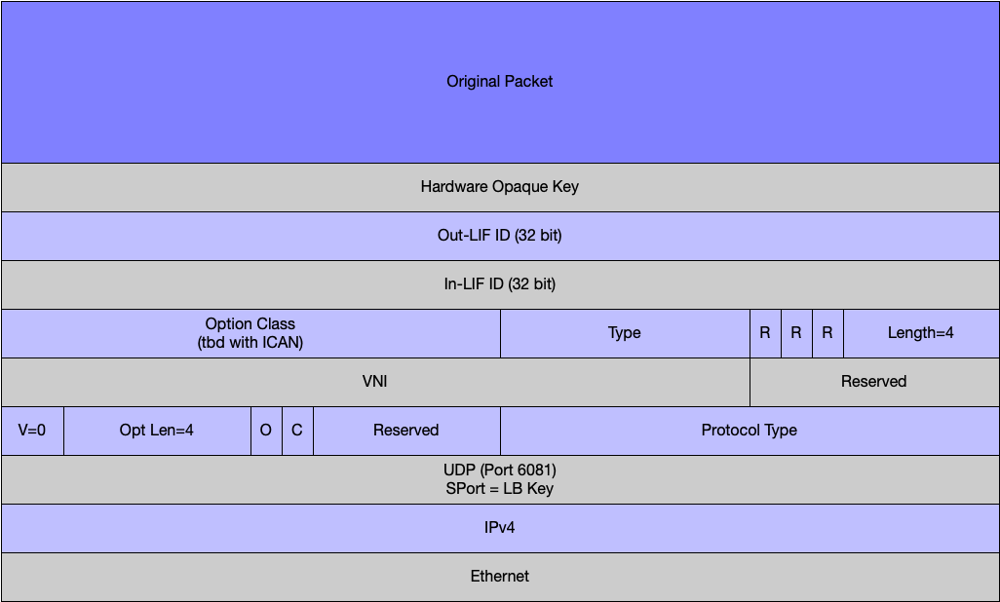

# Draft Open Offload Geneve Format

## Problem Statement
The goal is to steer traffic to a network function that supports OpenOffload from a network element without requiring the network function to paticipate in dynamic routing in a service provider network. The apporach selected is to encapsulate the original packet and deliver it to the network function using a UDP tunneling protocol. 

This approach preserves the original source/destination in the inner packet. The ingress and egress interfaces on the router/switch are also included in the metadata. This enables the application of policy or other network function logic on the original packet/session.

## Requirements
Requirements for the tunneling protocol
1. The encapsulation protocol SHOULD be an IETF standard.
2. The encapsulation protocol MUST enable the inner flows to be delivered to the firewall unchanged for classification and inspection.
3. The encapsulation protocol SHOULD be defined as a fixed header format to make inspection efficient by software and hardware.
4. The encapsulation protocol SHOULD have an identifier to enable the firewall to identify that it is a specific encapsulation format.
5. The encapsulation protocol MUST be extensible to carry additional metadata such as zone information (ingress/egress interface).
6. The encapsulation protocol MUST support IPV6 and IPV4.

## Discussion
Three possibilities for the encapsulation format were considered.

### VXLAN 
VXLAN while a popular standard does not have any extension mechanisms, VXLAN-GPE is designed to enable other embedded protocols, the only one currently defined is VXLAN-GPE with NSH. NSH is designed for service chaining and as such is fairly complex.

### Geneve 
Geneve is  another option, it is designed to be a flexible protocol with the ability to register a fixed format with ICAN. Its extensibility allows the definition of a new protocol while using a standard header and well known port. The extensions can be registered with ICAN to identify a specific set of extensions.

### Custom Protocol
A custom protocol was considered and evaluated but after developing it, there were not a lot of differences between the custom protocol and the Geneve extensions. The custom protocol could have used fewer bits, but the required information required was the same.

## Comparisons
While all three approaches would work, VXLAN-GPE was discarded as it would have required defining a new embedded protocol or trying to make NSH work. The custom protocol is more compact but had a similar disadvantage of defining a new proprietary protocol. Geneve was selected as it was sufficiently expressive and the format could be fixed to make it simpler for hardware to process

## Proposed Geneve Format
This section describes the proposed Geneve header for OpenOffload. The standard Geneve header fields are not defined here as they are already well defined in Reference 1.

The diagram below shows the proposed format for the fixed length Geneve Header. There are 96 bits of option fields defined. 

The fields are as follows:

**In-LIF:** A 32 identifier defining the logical interface for incoming traffic. This value is set by the transmitting network element. The receiver of the encapsulated packet uses the identifier to map to a policy element to be applied to the packet.

**Out-LIF:** A 32 identifier defining the logical interface for outgoing traffic. This value is set by the transmitting network element. The receiver of the encapsulated packet uses the identifier to map to a policy element to be applied to the packet.

**Hardware Opaque Key:** This a unique 32 bit hardware key set by the transmitting network element and is not used by the receiving service. 

For this Geneve extension there will be a new Option Class requested. The current Option Classes are listed in Reference 2 and the form to request a new Option Class is in Reference 3. 

## Optimizations
Both GPE and Geneve have the option of encapsulating the original packet to either include the Ethernet header or exclude it and encapsulate the original packet starting at the IP header. Just encapsulating the packet at the IP header will save 14 bytes, however the choice of implementation is left to the hardware as the cost and complexity of the encapsulation is most likely the highest impact, rather than the bandwidth.

## References
1. Geneve: Generic Network Virtualization Encapsulation
2. IANA Network Virtualization Overlay (NVO3) Assignments
3. Form to Request an Assignment from IANA for NVO3

